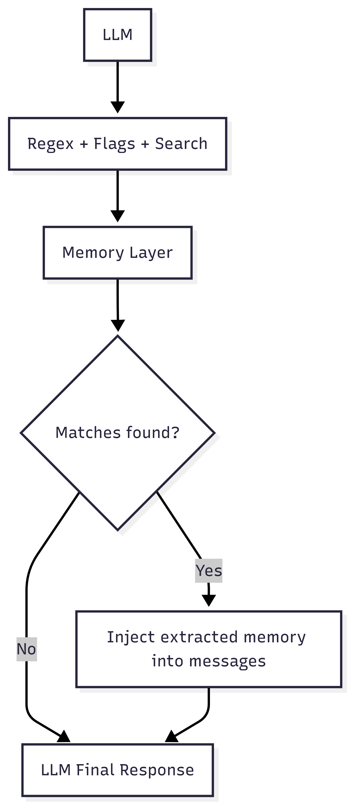

# Open Memory

A deterministic, regex-driven memory layer for LLMs. It emphasizes precise retrieval from externally supplied textual corpora and integrates matched snippets back into the model’s context for grounded responses.

## TextMemory (Regex-based LLM memory layer)



### How it works

1. The LLM proposes a regex pattern plus flags (the "search plan").
2. We execute that search against a simple memory layer (a text/Markdown file).
3. We extract only the matching snippets and inject them into the LLM messages.
4. The LLM produces the final response with just the relevant memory.

### Why this approach

- We hypothesize that high-quality regex/word search over plain text can be competitive on many tasks by precisely matching terms, formats, and structures without embedding drift.
- It keeps the system simple, fast, and transparent: no indexes, no vector stores, just a file and robust search.
- It limits context to only the matches, reducing prompt bloat while preserving fidelity.

### Programmatic usage

```python
import re
from open_memory import TextMemory

mem = TextMemory("Hello world. Error: disk full.\n\n## Header\nNext line.")
matches = mem.search_matches(r"error", flags=re.IGNORECASE)
for m in matches:
    print(m.text, m.span)
```

## Design goals

- **Simplicity**: a single text/markdown file is the memory.
- **Power**: the agent issues precise regex queries to find information.
- **Portability**: no server required; CLI and a tiny Python API.

## Quick Start

### Prerequisites

- Python 3.12+
- uv (for dependency management)

### Installation

1. Clone the repository:
```bash
git clone https://github.com/Mellow-Artificial-Intelligence/open-memory
cd open-memory
```

2. Install dependencies:
```bash
uv sync
```

3. Run a quick snippet:
```bash
uv run python -c "import re; from open_memory import TextMemory; m=TextMemory('An error occurred'); print([x.text for x in m.search_matches('error', flags=re.IGNORECASE)])"
```
## Notes on data

Open Memory operates over user-provided textual corpora (e.g., logs, notes, documentation). Typical usage reads file contents into `TextMemory` and applies deterministic regex-based retrieval to integrate matched snippets into downstream prompts.


## Contributing

1. Fork the repository
2. Create a feature branch
3. Make your changes
4. Test your changes
5. Submit a pull request

## License

This project is open source and available under the [MIT License](LICENSE).
